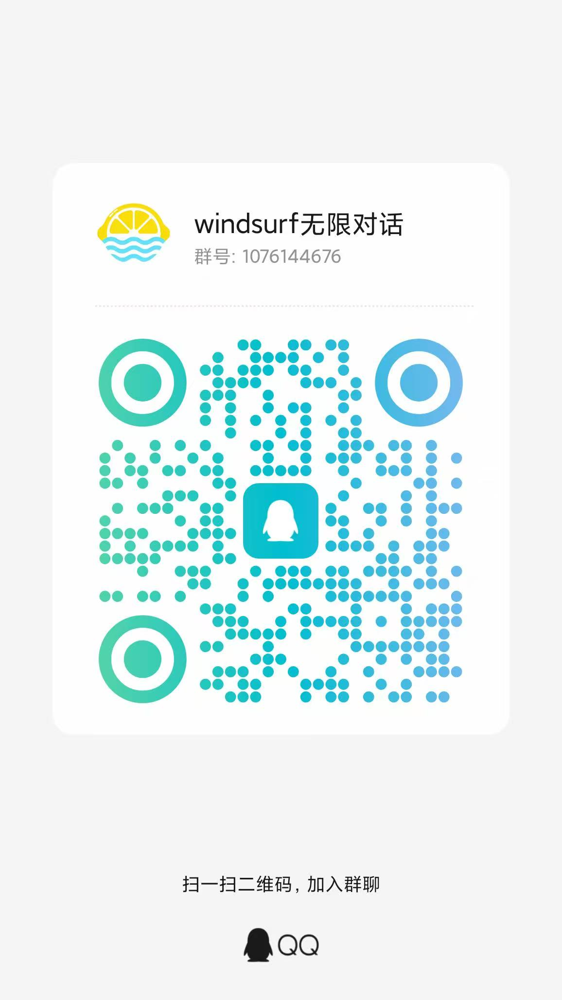

# windsurf无限对话

**柠檬酱windsurf无限对话工具** — 一款让 Windsurf AI 编程助手能够主动向用户提问、获取反馈的交互工具。

通过调用终端堵塞会话机制，在 AI 需要确认或澄清时弹出交互窗口，防止windsurf主动结束对话。达到延长对话的需求。实测最新模型opus 4.6 1m 版本可对话30轮以上  完全烧完每次对话token

---

## 核心功能

### 交互式反馈弹窗
- AI 编码过程中可随时调起弹窗向用户提问
- 支持预定义选项快速回复 + 自由文本输入
- 支持图片上传/粘贴（截图直接 Ctrl+V）
- Markdown 渲染 AI 提问内容，代码高亮显示
- 提示音通知（多种趣味音效可选）

### 消息队列系统
- 用户可提前编辑多条回复排队等待
- 队列管理器后台常驻运行（系统托盘图标）
- 弹窗出现时自动消费队列消息，倒计时后自动发送
- 支持取消自动发送，回退到手动输入模式
- 队列消息支持编辑、删除、拖拽排序

### 多模式支持
- **GUI 模式** — pywebview 原生窗口 + Vue 3 前端
- **CLI 模式** — 终端交互式反馈收集
- **队列管理模式** — 后台常驻 + 系统托盘
- **系统信息模式** — 收集环境信息供 AI 参考

### 自动配置
- 首次运行自动注入 Windsurf `global_rules.md` 配置
- 自动配置 MCP 工具调用规则，无需手动设置

---

## 技术栈

| 层级 | 技术 |
|------|------|
| 后端 | Python 3 · http.server · threading |
| 前端 | Vue 3 · TypeScript · Naive UI · Vite |
| 原生窗口 | pywebview (EdgeChromium) |
| 系统托盘 | pystray · Pillow |
| 打包 | PyInstaller |
| 通知音效 | winsound / mp3 |

---

## 快速开始

### 前置依赖

```bash
pip install pywebview
pip install pystray Pillow   # 可选，系统托盘支持
```

### 构建前端

```bash
cd frontend
npm install
npm run build
```

### 运行

```bash
# GUI 模式（AI 调用时自动弹窗）
python ai_feedback_tool_blocking.py --gui --project "你的项目路径" --summary "AI提问内容"

# 队列管理器（后台常驻，托盘图标）
python ai_feedback_tool_blocking.py --queue-manager

# CLI 模式
python ai_feedback_tool_blocking.py --cli --project "你的项目路径" --summary "AI提问内容"

# 系统信息
python ai_feedback_tool_blocking.py --system-info
```

### 打包为 EXE

```bash
pyinstaller 柠檬酱windsurf无限对话.spec
```

生成的可执行文件在 `dist/` 目录下。

---

## 项目结构

```
windsurf无限对话/
├── ai_feedback_tool_blocking.py   # 主程序（后端 + API + 队列管理）
├── icon.ico                       # 应用图标
├── sounds/                        # 提示音效
│   ├── elegant.mp3
│   ├── deng.mp3
│   └── ...
├── frontend/                      # Vue 3 前端
│   ├── src/
│   │   ├── App.vue               # 根组件（模式路由）
│   │   ├── components/
│   │   │   ├── McpPopup.vue      # 主反馈弹窗
│   │   │   ├── PopupInput.vue    # 输入区域
│   │   │   ├── PopupActions.vue  # 操作按钮栏
│   │   │   ├── QueueManager.vue  # 队列管理页面
│   │   │   ├── QueueFlashPopup.vue # 快闪自动发送弹窗
│   │   │   └── SettingsPage.vue  # 设置页面
│   │   └── types/
│   │       └── popup.ts          # TypeScript 类型定义
│   ├── package.json
│   └── vite.config.ts
├── 柠檬酱windsurf无限对话.spec     # PyInstaller 打包配置
└── README.md
```

---

## 工作原理

```
Windsurf AI ──(MCP调用)──> ai_feedback_tool_blocking.py
                                    │
                           ┌────────┴────────┐
                           │  检查消息队列    │
                           │  有消息? → 快闪弹窗 → 自动发送
                           │  无消息? → 正常弹窗 → 等待用户输入
                           └────────┬────────┘
                                    │
                              用户反馈 JSON
                                    │
                           Windsurf AI 接收并继续编码
```

1. Windsurf AI 通过 MCP 工具调用本程序
2. 程序检查消息队列，若有预编辑的消息则快闪弹窗倒计时自动发送
3. 若无队列消息，弹出完整交互窗口等待用户输入
4. 用户反馈以 JSON 格式返回给 AI，对话继续

---

## 邀请加入群聊

欢迎加入 **windsurf无限对话** QQ 群，交流使用心得、反馈问题、获取最新更新！

**群号: 1076144676**

<p align="center">
  
</p>
